<p align="center">
  
</p>

# Cantor Dust

A full-stack **company / consulting website** built with a modern React frontend and a small content API backed by MongoDB.

The project combines polished presentation pages with backend-managed data for the team, services, private-sector work, and development work.

## Product surface

The frontend currently contains routes for:

- Home
- About
- Services
- Insights
- Contact
- General Consulting
- Physical AI

The backend exposes API modules for:

- team data
- private-sector work
- development work
- services

## Tech stack

**Frontend:** React 19, Vite, React Router, Tailwind CSS, Framer Motion, Axios, React Fast Marquee  
**Backend:** Node.js, Express 5, MongoDB, Mongoose  
**Development:** Nodemon

## Architecture

```text
React + Vite
   │
   ├─ company pages
   ├─ service pages
   ├─ insights
   └─ motion / transitions
   │
Axios
   │
Express API
   │
   ├─ team
   ├─ services
   ├─ private-sector work
   └─ development work
   │
MongoDB
```

## Repository structure

```text
cantorDust/
├── cantroDustFrontend/
│   └── cantroDust/       # React/Vite frontend
└── cantorDustServer/     # Express/MongoDB backend
```

## Run locally

Frontend:

```bash
cd cantroDustFrontend/cantroDust
npm install
npm run dev
```

Backend:

```bash
cd cantorDustServer
npm install
node server.js
```

The API currently defaults to port `5000`, and the development CORS configuration expects the frontend on `http://localhost:5173`.

## What I learned

This project was useful for practicing the boundary between a **content-heavy marketing experience** and a backend that keeps repeatable company data outside the UI itself. It also gave me more experience with route transitions and motion that respects reduced-motion preferences.

## Status

**Archive / portfolio project.** Kept as a record of the architecture, UI work, and full-stack integration.

---

**Sanam Rai** · [GitHub profile](https://github.com/SanamRai001)
